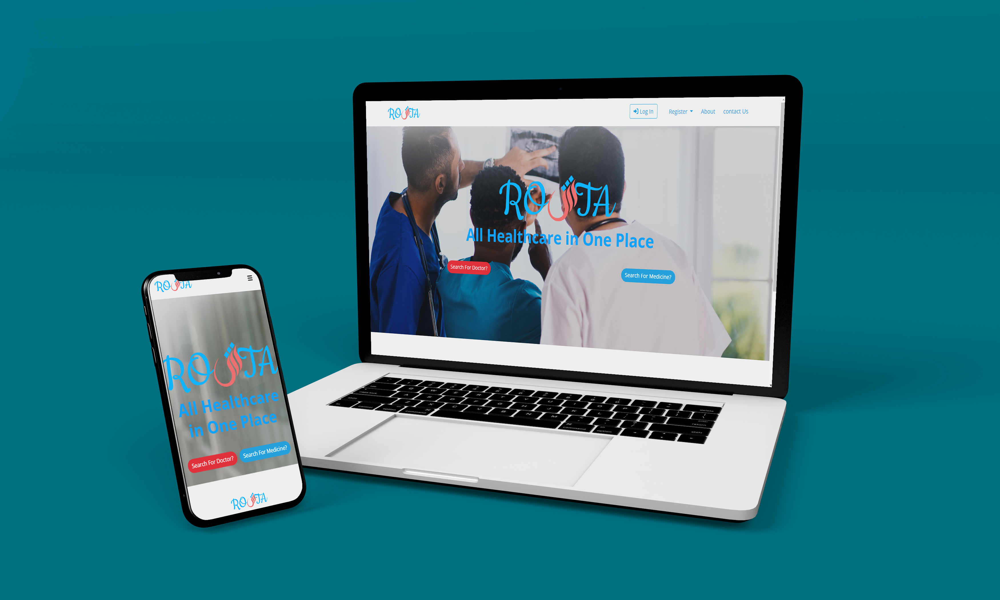
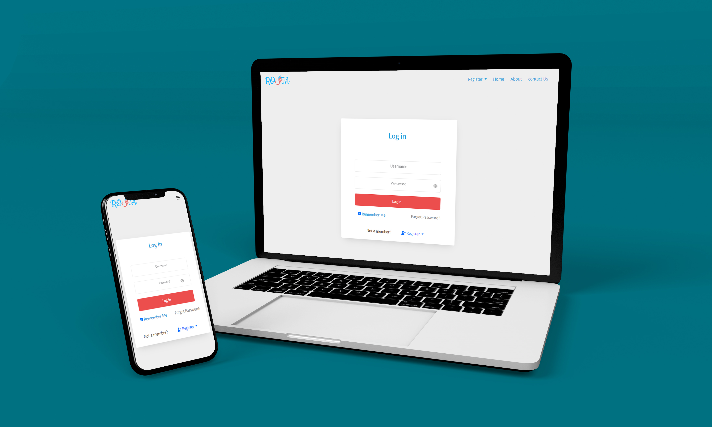
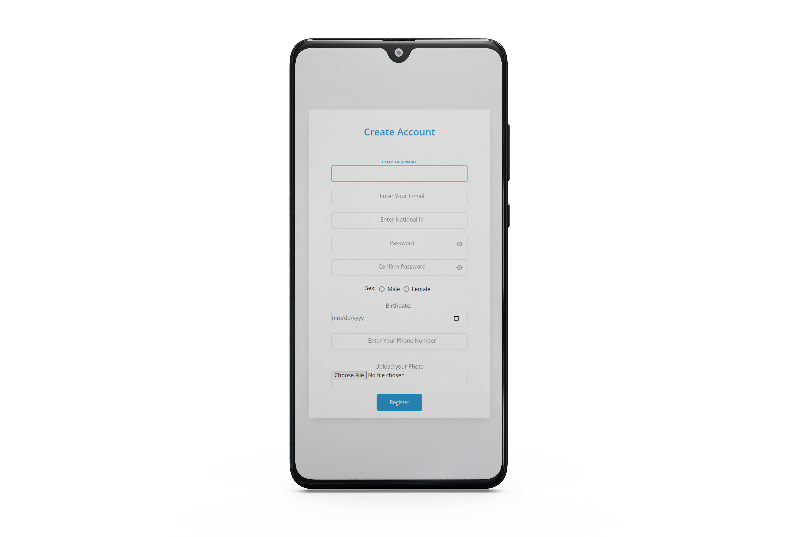
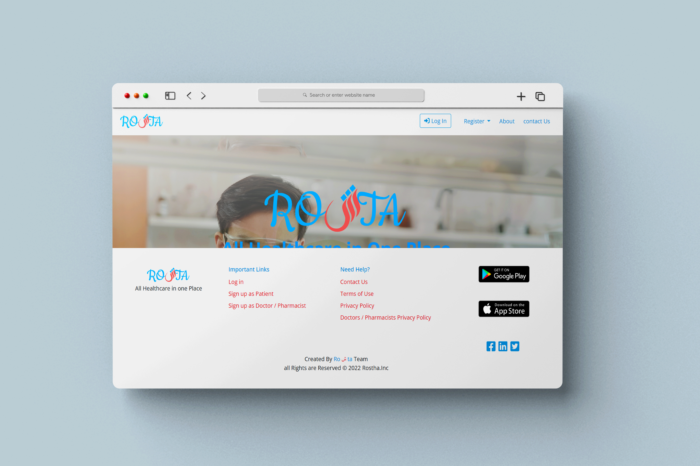

# Roshta-UI

this is an initial front-end design for Roshta website

I used Html, Bootstrap 5, sass, and pure JavaScript

The design is 100% responsive.
there are some screenshots from the website:

